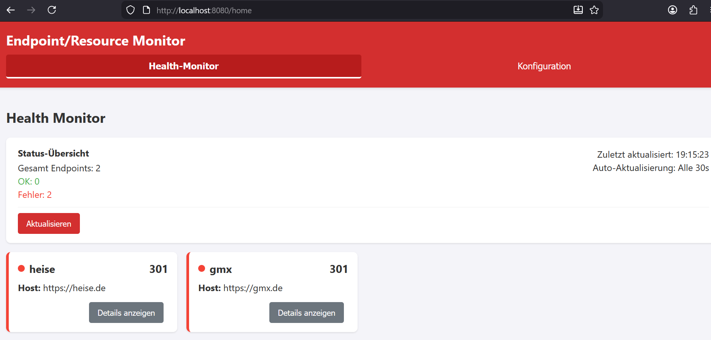

# quickstart-quarkus-web-server

	This is a minimal configuration for quarkus for serving as a web server. 
	No Servlet/REST-Implementation needed. Just put your web-resources on it!
	
	Branch WEB_MONITOR with an Web Monitor APP
	
# Usage
	clean install -> javaQuarkusRun.cmd
	http://localhost:8080
	

    

