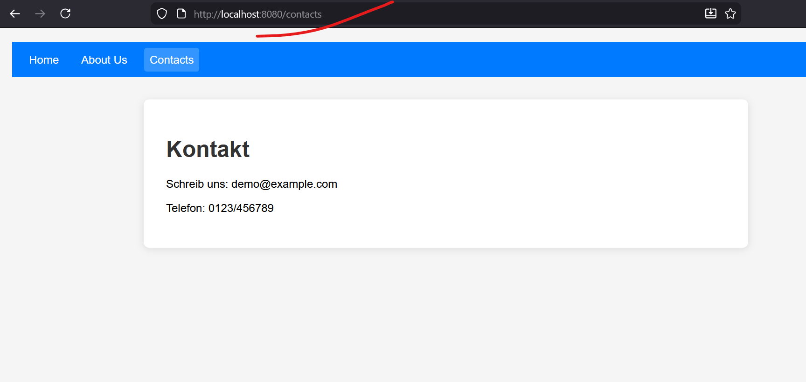

# quickstart-quarkus-web-server

	This is a minimal configuration for quarkus for serving as a web server. 
	No Servlet/REST-Implementation needed. Just put your web-resources on it!
	
	Branch ROUTING_WEB_HISTORY demonstrates directly navigation to "/contacts" of web static resources instead of showing a 404 error.
	
# Usage
	clean install -> javaQuarkusRun.cmd
	http://localhost:8080/contacts
	

    

